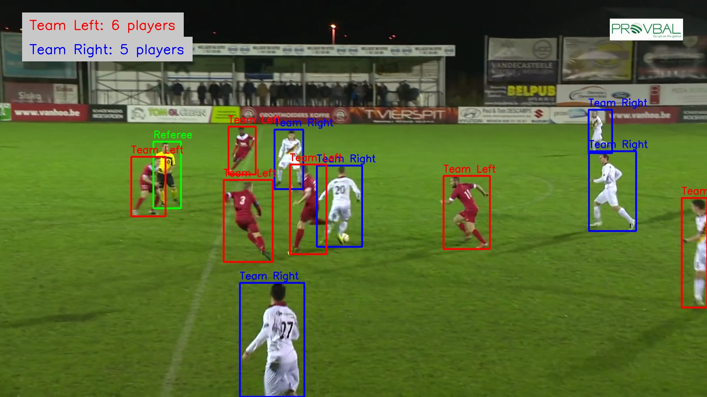

# Football Team Detection and Classification

This project detects football players in video footage and classifies them into teams based on their kit colors.
Note: usually not best practice to upload weights and videos to github, but done for simplicity of running the project.

## Features
- Player detection using YOLOv8
- Team classification based on kit colors
- Referee detection
- Output video with team annotations
- Frame-by-frame analysis

## Directory Structure
```
project/
├── data/
│ └── sample_video.mp4
├── output/
│ ├── input_frames/ # Input frames
│ ├── output_frames/ # Annotated frames
│ ├── match_processed.mp4 # Annotated video
│ └── teams_per_frame.json # Frame-by-frame team counts
├── checkpoints/
│ └── yolo_football.pt # Custom YOLO weights
├── src/
│ ├── __init__.py
│ ├── yolo_model.py
│ ├── kit_classifier.py
│ ├── player_tracker.py
│ ├── video_processor.py
├── main.py
├── Dockerfile
├── requirements.txt
└── README.md
```
## To Do
- Add support for real-time frame-by-frame processing (main next task, input should be a stream, perhaps with a buffer of 10 frames)
- Refactor video processing pipeline to handle streaming input
- Improve processing speed
- Create FastAPI for single frame processing
- Add tests

## Installation & Usage

### Manual Installation
Create virtual environment
` conda create -n football-detector python==3.11`

Install requirements
`pip install -r requirements.txt`

#### Usage
Video must be in the data directory
```
python main.py -i video_name.mp4
```

### Using Docker 

```
# Build the Docker image
docker build -t football-team-detector .

# Run the container with the video from the data directory
docker run --rm \
    -v $(pwd)/path/to/your/video:/app/input_video:ro \
    -v $(pwd)/output:/app/output \
    football-team-detector \
    -i /app/input_video/your_video.mp4
```

**Example:** if your video filepath is 'data/sample.mp4'
you would run:
```
docker run --rm \
    -v $(pwd)/data:/app/input_video:ro \
    -v $(pwd)/output:/app/output \
    football-team-detector \
    -i /app/input_video/sample.mp4
```

### API

[TO DO]

## Requirements
- Python 3.11
- OpenCV
- YOLOv8
- See requirements.txt for full list

## Output
The system generates:
1. Annotated video with team classifications
2. Frame-by-frame JSON analysis
3. Extracted frames with team annotations


### Detection Visualization
The output video and frames include:
- Red boxes: Team 1 players
- Blue boxes: Team 2 players
- Green boxes: Referees
- Player count display for each team
- Labels indicating player roles and team assignments

Example visualization:


## Model

### Required YOLO Classes
The model requires a pre-trained YOLO model that can detect these specific classes:
- "Player"
- "Main Referee"
- "Side Referee"
- "GoalKeeper"

### Model Weights
This project uses specific pre-trained weights from the SoccerNet dataset. You can obtain the weights in two ways:

1. **Download from Shared Link**:
   - Download the weights from: `[LINK still needed]`
   - Place the weights file in: `checkpoints/yolo_football.pt`

### Important Note
Custom training is not currently supported as it requires specific SoccerNet dataset access and preprocessing. Please use the provided pre-trained weights.
